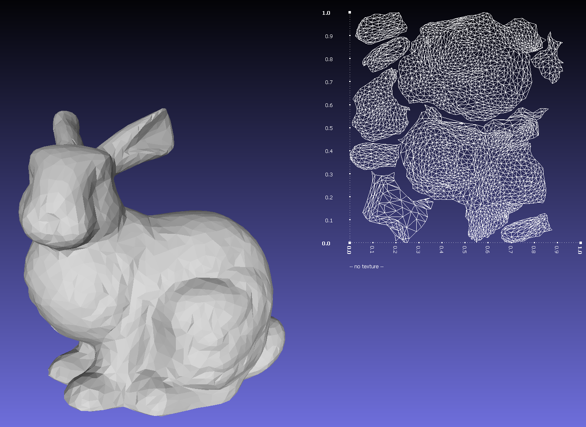
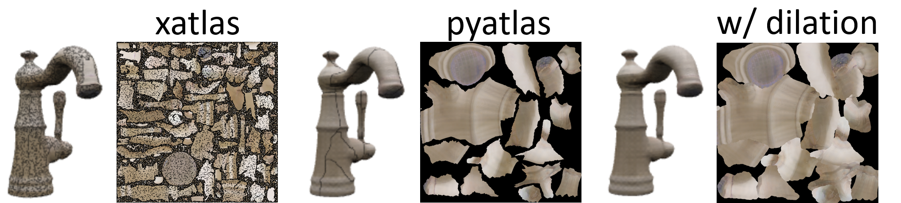

# Deprecated: please use [Open3d](https://www.open3d.org/docs/release/python_api/open3d.t.geometry.TriangleMesh.html#open3d.t.geometry.TriangleMesh.compute_uvatlas) and refer to [issue #1](https://github.com/f1shel/pyatlas/issues/1)

# pyatlas

A python wrapper of [UVAtlasTool](https://github.com/microsoft/UVAtlas). Tested on Linux(Ubuntu22.04) and python 3.10.14.






## Installation

```bash
pip install git+https://github.com/f1shel/pyatlas.git
```

## Usage

```python
from pyatlas import atlas
```
```bash
atlas(vertices, faces,
    maxCharts: int = 0,
    maxStretch: float = 0.16667,
    gutter: float = 2.0,
    width: int = 512,
    height: int = 512
)
```

## Example
```python
from pyatlas import atlas
import trimesh

mesh = trimesh.load("bunny.obj")
vmapping, indices, uvs = atlas(mesh.vertices, mesh.faces)

vertices[vmapping] # new_vertices (v, 3)
indices            # new_faces    (f, 3)
uvs                # texcoords    (v, 2)
```
